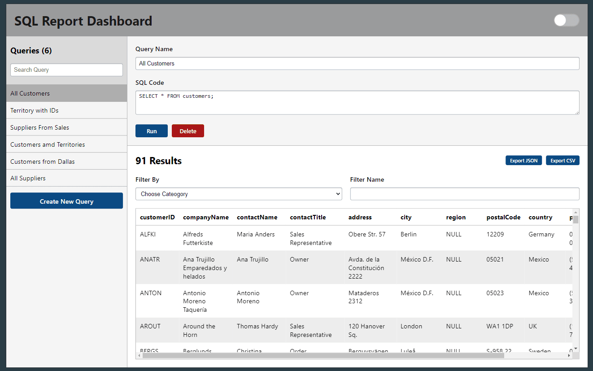
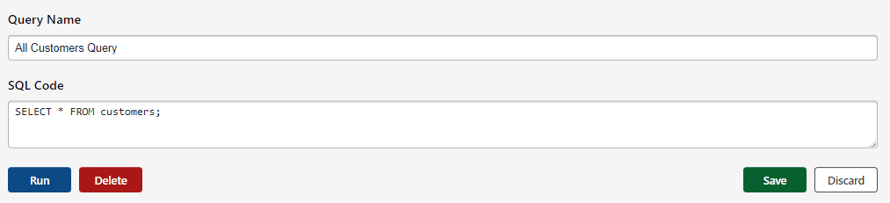
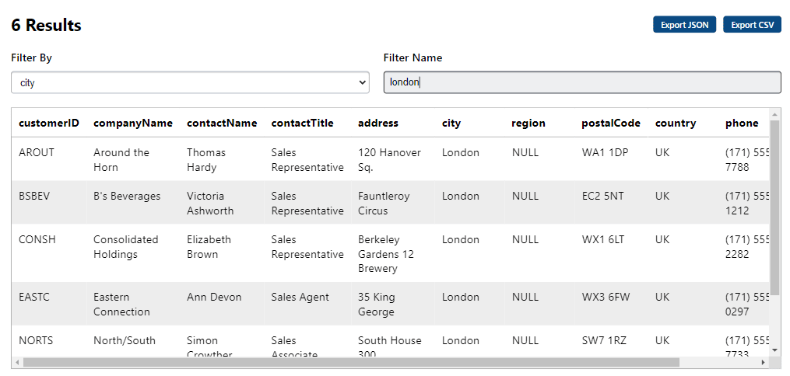
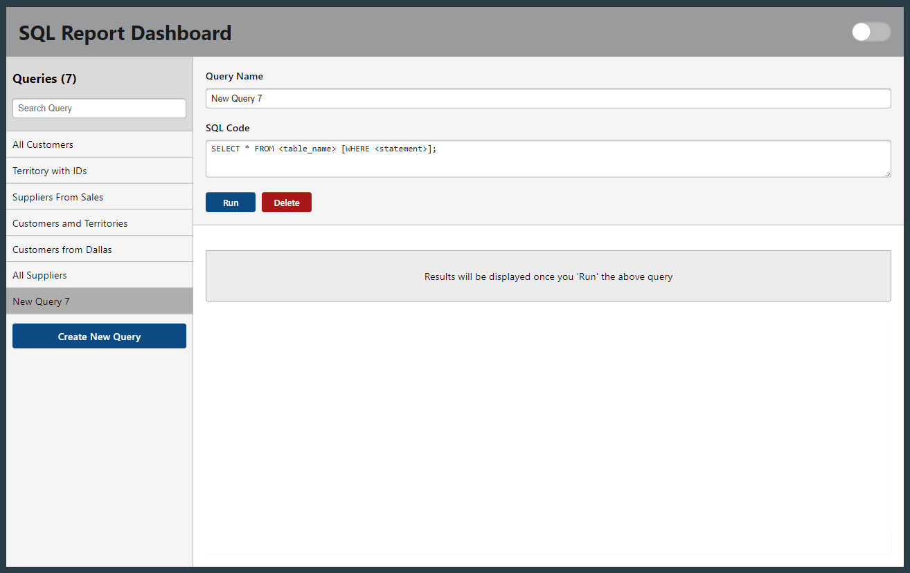
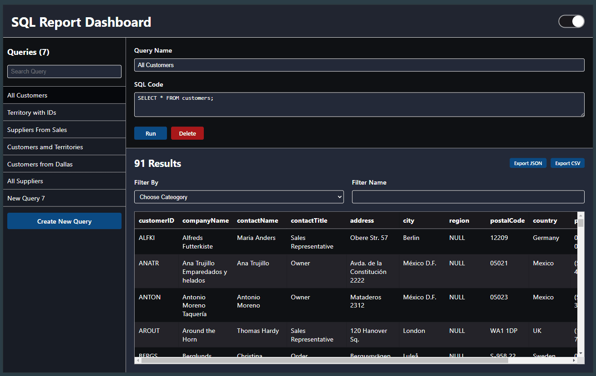
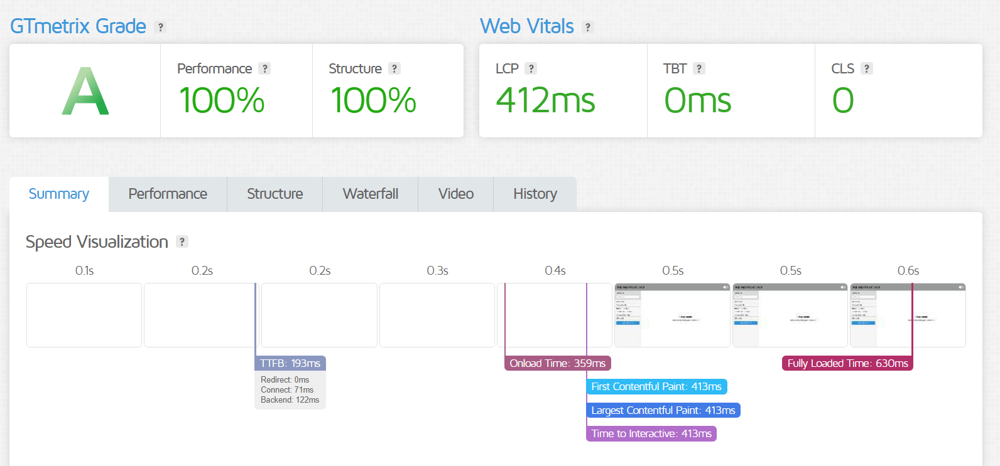
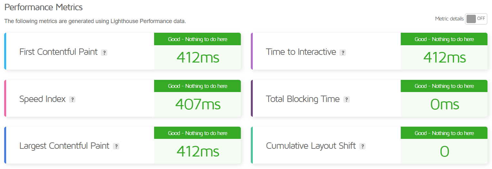
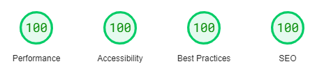
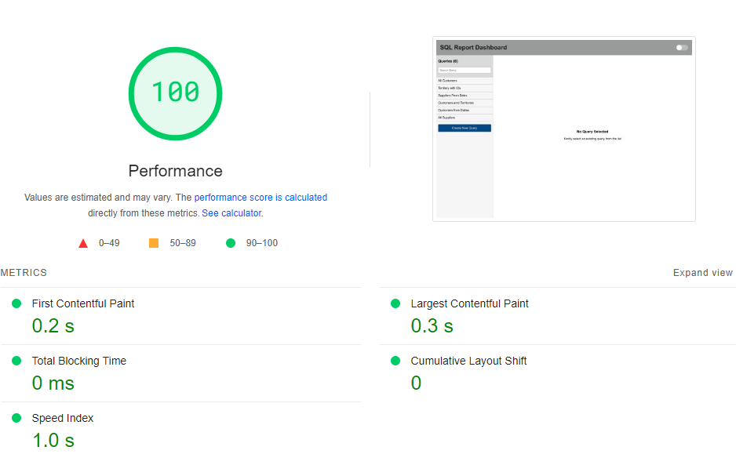

# React SQL Editor

## Description

Create, design and implement a web-based application capable of running SQL queries and displaying the results of said query. The application must include a space which accepts SQL queries in the form of user inputs, then runs the given query, and displays the result within the application.

## Features

- **Query List and Content** - On the left panel, a list of queries is shown which can be filtered by name. On choosing any of these queries, the details of the selected query is shown on the right side. This is divided with `Query Form` and `Query Result` sections.

- **Query Form** - The selected query has multiple actions
  - **Run** - Generates a report table from the given  `SQL code`.
  - **Delete** - Removes the query from the list.
  - **Update** - Allows to save or discard any change in query parameters (`Query name` and  `SQL code`)

- **Query Result** - The generated report table based on the selected query has multiple actions
  - **Filter** - Filters the table on the basis of selected `Filter Category` and `Filter Name` parameters.
  - **Export** - Allows to dowload the original/filtered table report in either `JSON` and `CSV` formats.

- **New Query Form** - On clicking `Create New Query` button, a new form with sample `Query name` and `SQL code` is shown to edit and save the data.

- **Theme Switching** - The `Toogle Switch` button at the top-right corner alters the theme of the application between `Light` (default) and `Dark` modes. This improves the readability by reducing cognitive stress for the user.

## Performance Audit

The Fully Loaded Time and First Contentful Paint (FCP) are in the range of `0.4s - 0.6s` and `0.2s - 0.4s` respectively.

### **[GTmetrix](https://gtmetrix.com/)**

 

### **[PageSpeeed Insights (web.dev)](https://pagespeed.web.dev/)**

 

## Improvements

- Performance
  - **Reduced API calls and computations** - This was achieved by using `useEffect` and `useMemo` hooks with required dependencies. More of these required once we add more features.
  - **CSS optimisation** - A mix of inline style and CSS classes were used instead of third-party CSS library. This can be further improved by adopting `Tailwind CSS`.
  - **Dynamic table fetching** - For displaying larger tables, the limited table rows will be fetched in a paginated fashion as per request. This row limit per page can also be customised by the user.
- Feature.
  - **Dynamic table sorting** - `SQL Code` input can be updated if we click to sort any column of the report table and vice versa.
  - **Fork/Clone query** - Any query can be duplicated to further update as per requirements.
  - **Confimation modal** - Any important action like - updating or deleting a query, should be confirmed by the user before exceution.
  - **Dynamic table filtering** - Multiple logical combinations of query filter parameters, to provide more personalised reports.
  - **Web responsive** - This can be achieved by CSS media query. Although, it is not recommended to display complex graphs and table reports in mobile view due to limited screen size. However, a summarised and minimal text report can be helpful in such conditions.

## Available Scripts

This project was bootstrapped with [Create React App](https://github.com/facebook/create-react-app). In the project directory, you can run:

### `npm start`

Runs the app in the development mode.\
Open [http://localhost:3000](http://localhost:3000) to view it in your browser.

The page will reload when you make changes.\
You may also see any lint errors in the console.

### `npm test`

Launches the test runner in the interactive watch mode.\
See the section about [running tests](https://facebook.github.io/create-react-app/docs/running-tests) for more information.

### `npm run build`

Builds the app for production to the `build` folder.\
It correctly bundles React in production mode and optimizes the build for the best performance.

The build is minified and the filenames include the hashes.\
Your app is ready to be deployed!

See the section about [deployment](https://facebook.github.io/create-react-app/docs/deployment) for more information.
